<h2>TensorFlow-FlexUNet-Image-Segmentation-Refined-Deep-SAR-Oil-Spill  (2025/12/30)</h2>
Toshiyuki Arai 
Software Laboratory antillia.com  
This is the first experiment of Image Segmentation for <b>SAR Oil Spill (SOS)</b> based on our <a href="./src/TensorFlowFlexUNet.py">TensorFlowFlexUNet</a> 
(TensorFlow Flexible UNet Image Segmentation Model for Multiclass) , 
and 
<a href="https://zenodo.org/records/15298010">Refined Deep-SAR Oil Spill (SOS) dataset </a> on zenodo.org.
  

<b>Actual Image Segmentation for Refined Deep-SAR Oil Spill (SOS) Images of 256x256 pixels</b> 
As shown below, the inferred masks predicted by our segmentation model trained by the dataset appear similar to the ground truth masks, but they lack precision in certain areas.
  
<table>
<tr>
<th>Input: image</th>
<th>Mask (ground_truth)</th>
<th>Prediction: inferred_mask</th>
</tr>
<tr>
<td>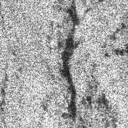</td>
<td></td>
<td></td>
</tr>

<tr>
<td>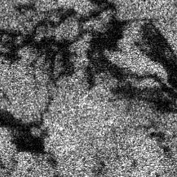</td>
<td></td>
<td></td>
</tr>

<tr>
<td>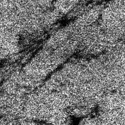</td>
<td></td>
<td>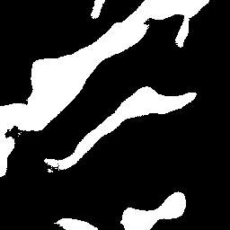</td>
</tr>
</table>

 
<h3>1  Dataset Citation</h3>
The dataset used here was obtained from   
<a href="https://zenodo.org/records/15298010">Refined Deep-SAR Oil Spill (SOS) dataset </a> on zenodo.org.

  
This is the improved version of the Deep-SAR Oil Spill (SOS) datase [1]. 
To enhance training data quality, segmentation masks with significant annotation errors were manually corrected.  
Approximately 38% of the training masks and 50% of the validation masks were revised based on visual inspection and annotation consistency.  
These refinements aimed to reduce label noise and improve model performance during training and evaluation.
 
 
[1] Q. Zhu, Y. Zhang, Z. Li, X. Yan, Q. Guan, Y. Zhong,  L. Zhang, and D. Li,  
“Oil Spill Contextual and Boundary-Supervised Detection Network Based on Marine SAR Images, 
” IEEE Transactions on Geoscience and Remote Sensing, 2021.DOI: 10.1109/TGRS.2021.31 

 
<b>Citation</b> 
Citation
Authors. (2025). Refined Deep-SAR Oil Spill (SOS) dataset [Data set]. Zenodo. 
<a href="https://doi.org/10.5281/zenodo.15298010"> https://doi.org/10.5281/zenodo.15298010</a>
 
 
<b>License</b> 
<a href="https://creativecommons.org/licenses/by/4.0/legalcode">Creative Commons Attribution 4.0 International</a>
 
 
<h3>
2 SOS ImageMask Dataset
</h3>
 If you would like to train this SOS Segmentation model by yourself,
please down load the following two zip files in the web site <a href="https://zenodo.org/records/15298010">Refined Deep-SAR Oil Spill (SOS) dataset</a>  

<a  href="https://zenodo.org/records/15298010/files/images.zip?download=1">images.zip</a> 
<a  href="https://zenodo.org/records/15298010/files/masks.zip?download=1">masks.zip</a> 
, and expand the downloaded in a working directory. 
The folder structure of the <b>SOS</b> dataset is the following.  
<pre>
./SOS
├─images
│   ├─train
│         ├─palsar_0.png
          ...
│         └─sentinel_3353.png
│   └─val
│         ├─palsar_0.png
           ...
│         └─sentinel_838.png
└─masks
    ├─train
    │     ├─palsar_0.png
           ...
    │     └─sentinel_3353.png
    └─val
          ├─palsar_0.png
          ...
          └─sentinel_838.png
</pre>
We used a Python script <a href="./generator/split_master.py">split_master.py</a> to split the master train  into
<b>train</b> and <b>test</b> subsets, and rearranged the original images and masks  folders to take the following structure. 
<pre>
./dataset
└─SOS
    ├─test
    │   ├─images
    │   └─masks
    ├─train
    │   ├─images
    │   └─masks
    └─valid
        ├─images
        └─masks
</pre>
 
<b>SOS Statistics</b> 
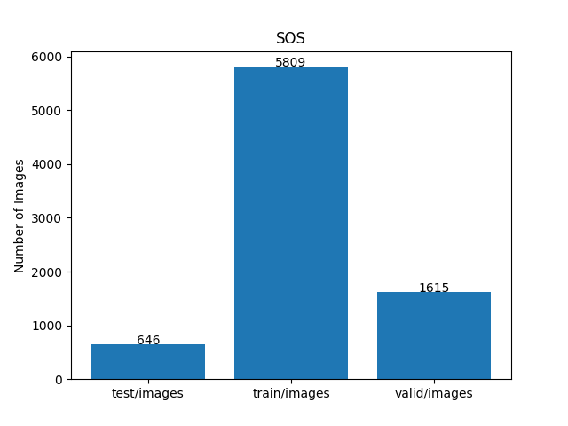 
 
As shown above, the number of images of train and valid datasets is large enough to use for a training set of our segmentation model.
  
<b>Train_images_sample</b> 
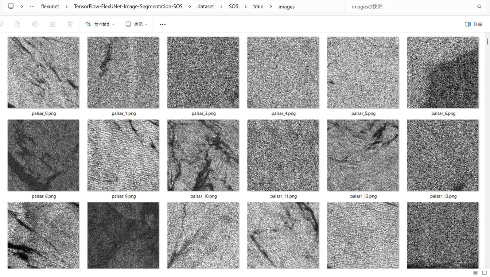
 
<b>Train_masks_sample</b> 
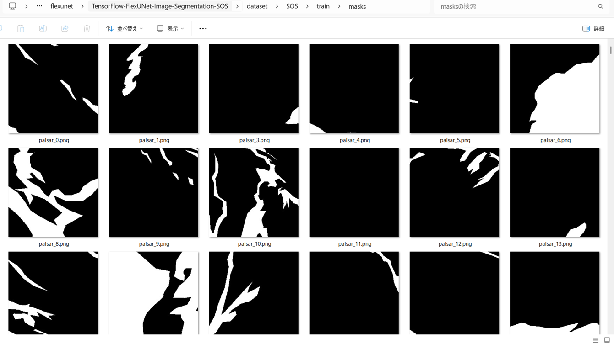
 
<h3>
3 Train TensorflowFlexUNet Model
</h3>
 We trained SOS TensorflowFlexUNet Model by using the following
<a href="./projects/TensorFlowFlexUNet/SOS/train_eval_infer.config"> <b>train_eval_infer.config</b></a> file.  
Please move to ./projects/TensorFlowFlexUNet/SOS and run the following bat file. 
<pre>
>1.train.bat
</pre>
, which simply runs the following command. 
<pre>
>python ../../../src/TensorFlowFlexUNetTrainer.py ./train_eval_infer.config
</pre>

<b>Model parameters</b> 
Defined a small <b>base_filters=16</b> and a large <b>base_kernels=(11,11)</b> for the first Conv Layer of Encoder Block of 
<a href="./src/TensorflowUNet.py">TensorflowUNet.py</a> 
and a large num_layers (including a bridge between Encoder and Decoder Blocks).
<pre>
[model]
image_width    = 256
image_height   = 256
image_channels = 3
input_normalize = True
normalization  = False

num_classes    = 2

base_filters   = 16
base_kernels  = (11,11)
num_layers    = 8

dropout_rate   = 0.05
dilation       = (1,1)
</pre>

<b>Learning rate</b> 
Defined a small learning rate.  
<pre>
[model]
learning_rate  = 0.00007
</pre>

<b>Loss and metrics functions</b> 
Specified "categorical_crossentropy" and "dice_coef_multiclass". 
<pre>
[model]
loss           = "categorical_crossentropy"
metrics        = ["dice_coef_multiclass"]
</pre>
<b >Learning rate reducer callback</b> 
Enabled learing_rate_reducer callback, and a small reducer_patience.
<pre> 
[train]
learning_rate_reducer = True
reducer_factor     = 0.4
reducer_patience   = 4
</pre>
<b>Early stopping callback</b> 
Enabled early stopping callback with patience parameter.
<pre>
[train]
patience      = 10
</pre>
<b></b> 
<b>RGB color map</b> 
rgb color map dict for SOS 1+1 classes. 
<pre>
[mask]
mask_file_format = ".png"
;SOS 1+1
rgb_map = {(0,0,0):0,  (255, 255, 255):1, }       
</pre>
<b>Epoch change inference callbacks</b> 
Enabled epoch_change_infer callback. 
<pre>
[train]
epoch_change_infer       = True
epoch_change_infer_dir   =  "./epoch_change_infer"
epoch_changeinfer        = False
epoch_changeinfer_dir    = "./epoch_changeinfer"
num_infer_images         = 6
</pre>
By using this epoch_change_infer callback, on every epoch_change, the inference procedure can be called
 for 6 images in <b>mini_test</b> folder. This will help you confirm how the predicted mask changes 
 at each epoch during your training process.    
<b>Epoch_change_inference output at starting (1,2,3)</b> 
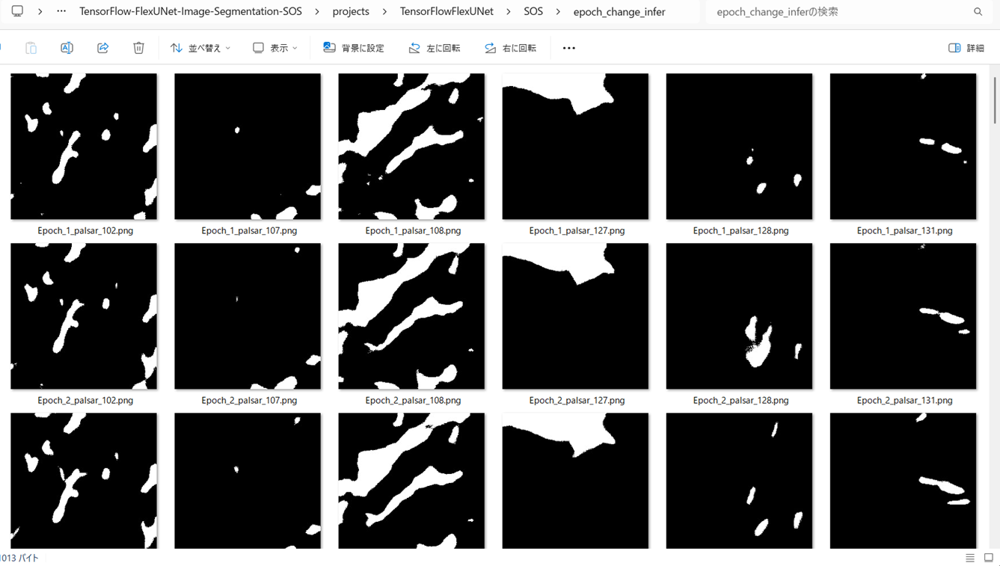 
 
<b>Epoch_change_inference output at ending (12,13,14)</b> 
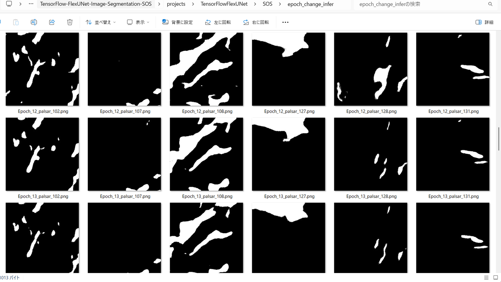 
 
<b>Epoch_change_inference output at ending (26,27,28)</b> 
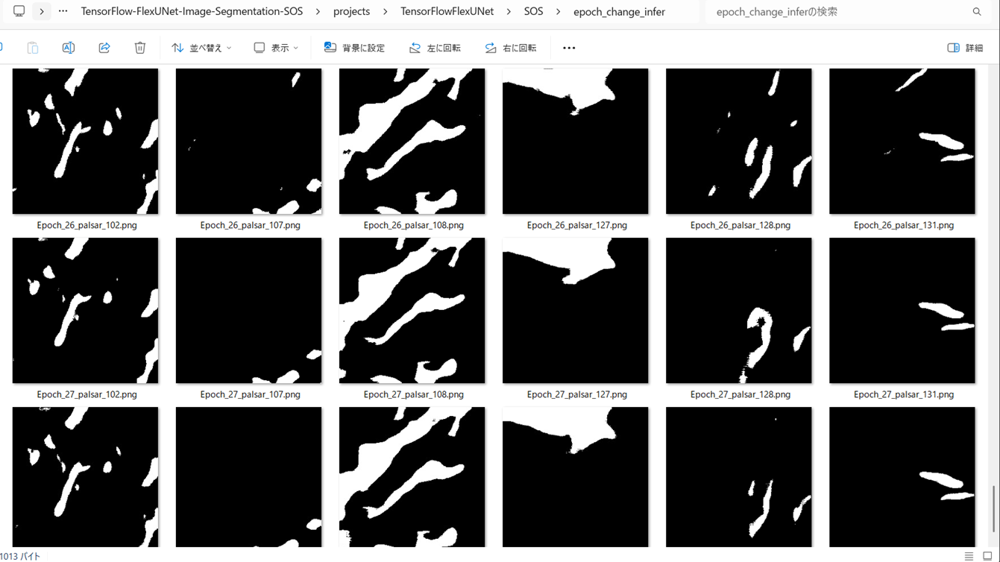 

 
In this experiment, the training process was stopped at epoch 28 by EarlyStoppingCallback.  
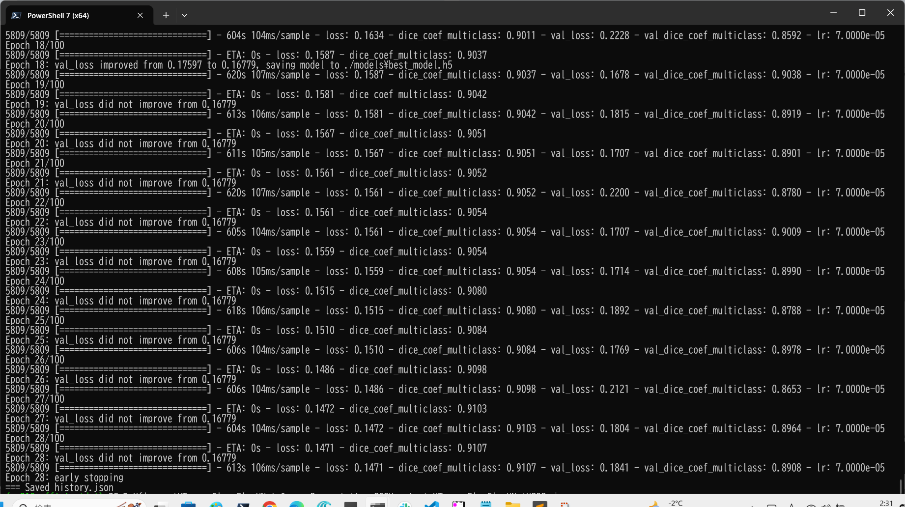 
 
<a href="./projects/TensorFlowFlexUNet/SOS/eval/train_metrics.csv">train_metrics.csv</a> 
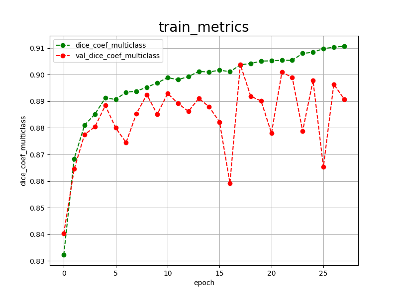 

 
<a href="./projects/TensorFlowFlexUNet/SOS/eval/train_losses.csv">train_losses.csv</a> 
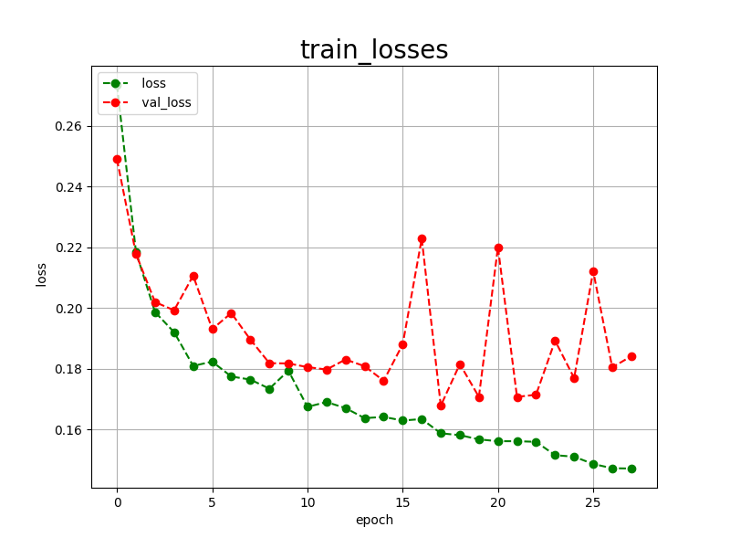 
 
<h3>
4 Evaluation
</h3>
Please move to a <b>./projects/TensorFlowFlexUNet/SOS</b> folder, 
and run the following bat file to evaluate TensorflowFlexUNet model for SOS. 
<pre>
>./2.evaluate.bat
</pre>
This bat file simply runs the following command.
<pre>
>python ../../../src/TensorFlowFlexUNetEvaluator.py  ./train_eval_infer.config
</pre>
Evaluation console output: 
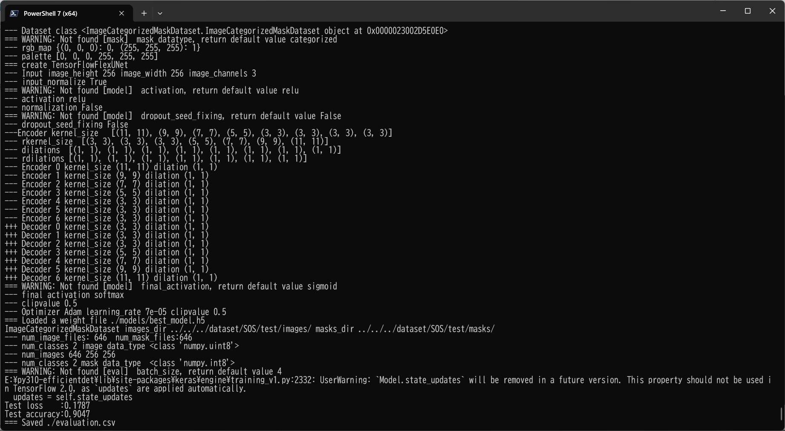
  Image-Segmentation-SOS

<a href="./projects/TensorFlowFlexUNet/SOS/evaluation.csv">evaluation.csv</a> 
The loss (categorical_crossentropy) to this SOS/test was not low, and dice_coef_multiclass  not high as shown below.
 
<pre>
categorical_crossentropy,0.1787
dice_coef_multiclass,0.9047
</pre>
 
<h3>5 Inference</h3>
Please move to a <b>./projects/TensorFlowFlexUNet/SOS</b> folder 
,and run the following bat file to infer segmentation regions for images by the Trained-TensorflowFlexUNet model for SOS. 
<pre>
>./3.infer.bat
</pre>
This simply runs the following command.
<pre>
>python ../../../src/TensorFlowFlexUNetInferencer.py ./train_eval_infer.config
</pre>

<b>mini_test_images</b> 
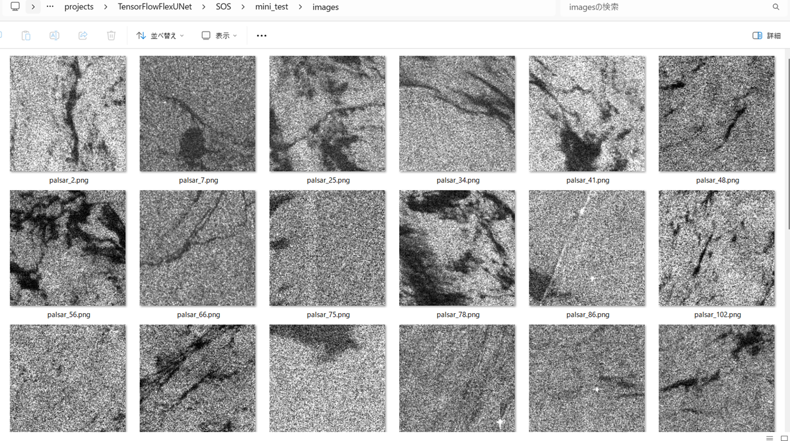 
<b>mini_test_mask(ground_truth)</b> 
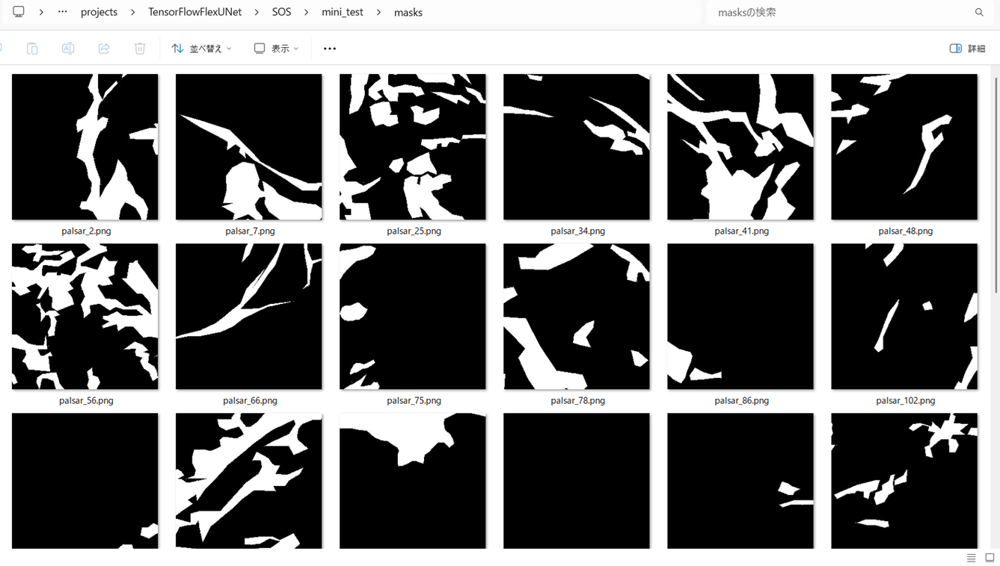 

<b>Inferred test masks</b> 
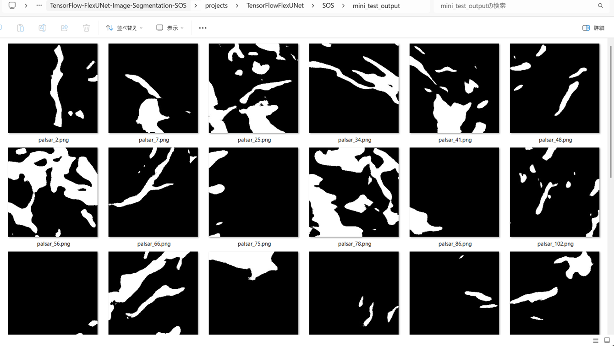 
 

<b>Enlarged images and masks for  Refined Deep-SAR Oil Spill (SOS) Images of 256x256 pixels</b> 
As shown below, the inferred masks predicted by our segmentation model trained by the dataset appear similar to the ground truth masks, but they lack precision in certain areas.
 
 
<table>
<tr>
<th>Input: image</th>
<th>Mask (ground_truth)</th>
<th>Prediction: inferred_mask</th>
</tr>
<tr>
<td>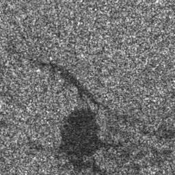</td>
<td></td>
<td></td>
</tr>

<tr>
<td></td>
<td></td>
<td></td>
</tr>

<tr>
<td></td>
<td></td>
<td></td>
</tr>
<tr>
<td>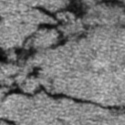</td>
<td></td>
<td></td>
</tr>
<tr>
<td>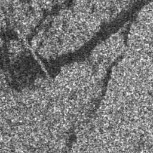</td>
<td></td>
<td></td>
</tr>
<tr>
<td>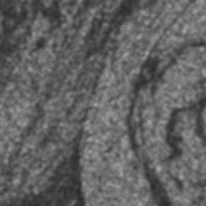</td>
<td></td>
<td></td>
</tr>
</table>

 
<h3>
References
</h3>
<b>1. Oil Spill Detection using Convolutional Neural Networks and Sentinel-1 SAR Imagery</b> 
Eleftheria Kalogirou, Konstantinos Christofi, Despoina Makri, Muhammad Amjad Iqbal, Valeria La Pegna, 
Marios Tzouvaras, Christodoulos Mettas, Diofantos Hadjimitsis 
<a href="https://isprs-archives.copernicus.org/articles/XLVIII-G-2025/757/2025/isprs-archives-XLVIII-G-2025-757-2025.pdf">
https://isprs-archives.copernicus.org/articles/XLVIII-G-2025/757/2025/isprs-archives-XLVIII-G-2025-757-2025.pdf</a>
 
 
<b>2. Oil spill detection and classification through deep learning and tailored data augmentation</b> 
Ngoc An Bui,  Youngon Oh,  Impyeong Lee 
<a href="https://www.sciencedirect.com/science/article/pii/S1569843224001997">https://www.sciencedirect.com/science/article/pii/S1569843224001997</a>
 
 
<b>3. Oil spill detection by imaging radars: Challenges and pitfalls</b> 
Werner Alpers , Benjamin Holt, Kan Zeng  
<a href="https://www.sciencedirect.com/science/article/pii/S0034425717304145">https://www.sciencedirect.com/science/article/pii/S0034425717304145</a>
 
 
<b>4.  Detection of Oil Spill in SAR Image Using an Improved DeepLabV3+</b> 
Jiahao Zhang, Pengju Yang, and Xincheng Ren  
<a href="https://www.mdpi.com/1424-8220/24/17/5460">https://www.mdpi.com/1424-8220/24/17/5460</a>
 
 
<b>5.  Oil-Spill-Detection</b> 
Harsha0112 
<a href="https://github.com/Harsha0112/Oil-Spill-Detection">https://github.com/Harsha0112/Oil-Spill-Detection</a>
 
 
<b>6. TensorFlow-FlexUNet-Image-Segmentation-Oil-Spill</b> 
Toshiyuki Arai  
<a href="https://github.com/sarah-antillia/TensorFlow-FlexUNet-Oil-Spill">
https://github.com/sarah-antillia/TensorFlow-FlexUNet-Image-Oil-Spill
</a>
 
 
